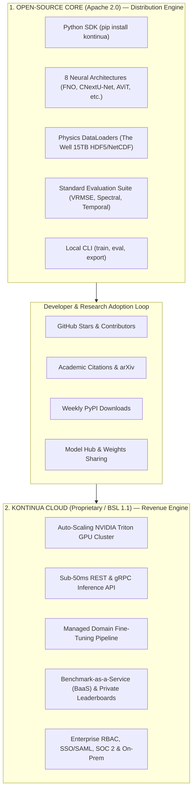
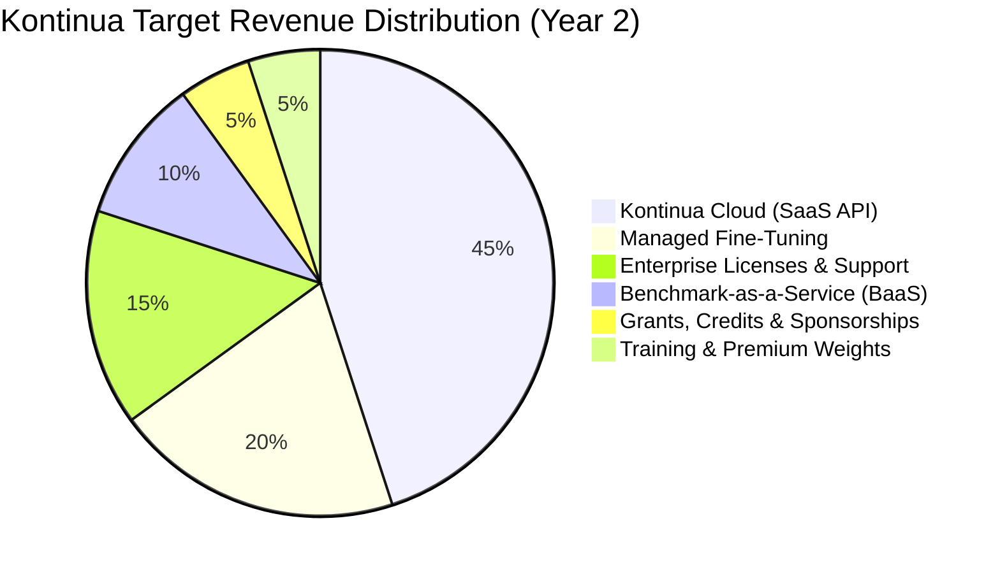
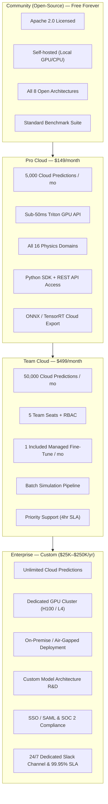
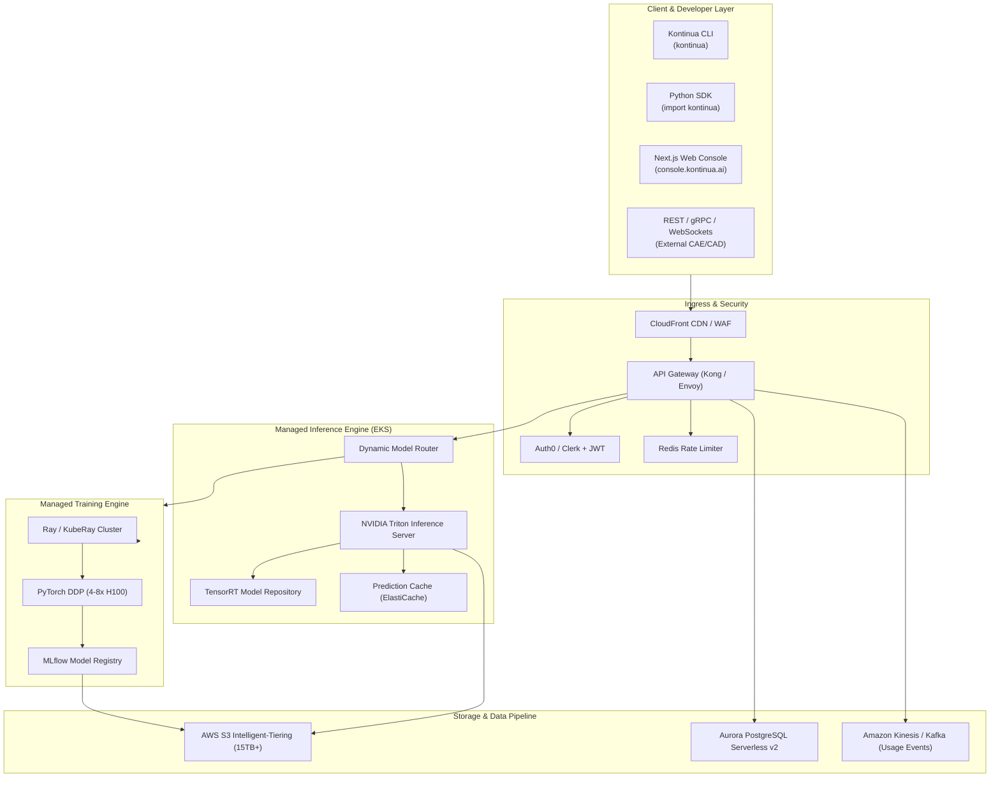
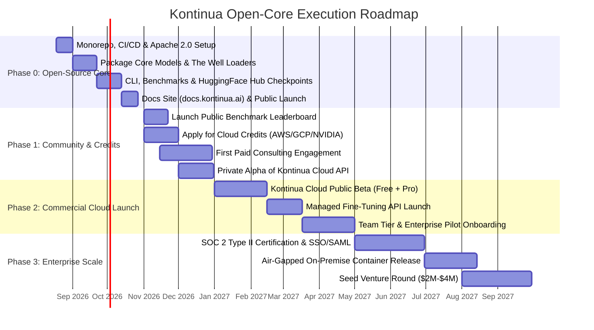

# Kontinua — Open-Core Physics AI Platform

**Comprehensive Strategy: Open-Source Foundation + Commercial Cloud**  
**Updated: August 2026 | Classification: Executive Review**

---

## 1. Strategic Foundation: The Open-Core Model

> [!IMPORTANT]
> Open-sourcing the foundational library is not giving away value — it is the proven high-growth playbook used by the most successful modern developer and AI platforms (Hugging Face, Databricks, Elastic, HashiCorp, dbt Labs, MongoDB).
> **The code is the distribution engine. The moat is the cloud infrastructure, data pipeline, and managed surrogate modeling service that sits on top.**



### 1.1 Proof: Open-Source to Multi-Billion Dollar Revenue

| Company | Open-Source Core | Revenue / Valuation | Commercial Monetization |
| :--- | :--- | :--- | :--- |
| **Hugging Face** | `transformers` library | $4.5B valuation | Hub hosting, Inference Endpoints, Enterprise Hub |
| **Databricks** | Apache Spark | $43B valuation | Managed Lakehouse compute platform |
| **Elastic** | Elasticsearch | $2B+ annual revenue | Elastic Cloud managed search & observability |
| **HashiCorp** | Terraform, Vault | Acquired for $5.7B | HCP Cloud, governance & enterprise tooling |
| **dbt Labs** | `dbt-core` | $4.1B valuation | dbt Cloud (managed orchestration & semantic layer) |
| **MongoDB** | MongoDB Community | $1.7B annual revenue | MongoDB Atlas (managed cloud database) |
| **Weights & Biases** | `wandb` client | $1.25B valuation | Cloud tracking platform, Enterprise MLOps |
| **LangChain** | LangChain framework | $200M+ valuation | LangSmith (hosted tracing, evaluation & monitoring) |

### 1.2 Why Open-Core is the Winning Strategy for Kontinua

1. **Scientists & Engineers Demand Reproducibility**: Aerospace, energy, and mechanical engineers will not trust closed black-box APIs without inspecting the underlying mathematics and neural operator code. Open code delivers instant institutional credibility.
2. **Zero-Budget Viral Distribution**: Every GitHub star, academic paper citation, and `pip install` generates qualified inbound enterprise leads at $0 customer acquisition cost (CAC).
3. **Synergy with The Well Dataset**: The Well is released under the commercially permissive BSD 3-Clause license. An open-core platform natively aligns with this ecosystem.
4. **Frictionless Enterprise PoC**: Engineers can benchmark and prototype locally on their laptops before upgrading to Kontinua Cloud for multi-node GPU scale, API integration, and batch simulations.

---

## 2. Architecture Boundary: Open-Source vs. Commercial Cloud

```mermaid
flowchart LR
    subgraph OPEN_SOURCE["Open-Source (pip install kontinua)"]
        direction TB
        OS1["PyTorch Model Zoo (8 Architectures)"]
        OS2["The Well HDF5/NetCDF DataLoaders"]
        OS3["Physics-Aware Augmentation & Normalization"]
        OS4["Spatial, Spectral & Temporal Metrics"]
        OS5["ONNX & TensorRT Local Export"]
        OS6["Local Training & Rollout CLI"]
    end

    subgraph PROPRIETARY_CLOUD["Kontinua Cloud (Managed Platform)"]
        direction TB
        PC1["Multi-Tenant Triton GPU Orchestrator"]
        PC2["Sub-50ms Low-Latency Inference API"]
        PC3["Automated Architecture Model Router"]
        PC4["Managed Fine-Tuning on H100 GPU Clusters"]
        PC5["Benchmark-as-a-Service (Private CI/CD)"]
        PC6["Team Collaboration, SSO & SOC 2 Compliance"]
        PC7["3D Domain Foundation Weights"]
    end

    OPEN_SOURCE -.->|"Deploy to Cloud / API"| PROPRIETARY_CLOUD
```



### 2.1 What Goes Open-Source (`Apache 2.0`)

The public repository (`kontinua/kontinua`) and PyPI package include:

```
kontinua/
├── core/
│   ├── models/           # FNO, CNextU-Net, TFNO, AViT, AFNO, DilatedResNet, ReFNO
│   ├── data/             # WellDataset, HDF5/NetCDF stream loaders, xarray integration
│   ├── metrics/          # Spatial (VRMSE, L-inf), Spectral (Fourier MSE), Temporal (Wasserstein-1)
│   ├── normalization/    # Physics-aware Z-score & delta scaling
│   └── training/         # PyTorch DDP training loops, Hydra configurations
├── domains/              # 16 physics domain definitions (Turbulence, CFD, MHD, etc.)
├── benchmarks/           # Standardized evaluation harness
├── export/               # Local ONNX and TensorRT compilation scripts
└── cli/                  # CLI tool: `kontinua train`, `kontinua eval`, `kontinua download`
```

### 2.2 What Stays Proprietary / Commercial (`BSL 1.1` & Cloud Hosted)

The cloud-managed layer provides infrastructure that engineering teams cannot or do not want to manage in-house:

* **Inference Cloud**: Auto-scaling NVIDIA Triton Inference Server on Kubernetes (EKS) with TensorRT dynamic batching and sub-50ms p95 latency.
* **Intelligent Model Router**: Dynamic neural routing that selects the best-performing architecture for a given PDE domain and mesh resolution.
* **Managed Fine-Tuning**: Web and API service that accepts custom CAD/CFD boundary conditions, validates meshes, orchestrates multi-GPU training runs, and auto-provisions dedicated endpoints.
* **Benchmark-as-a-Service (BaaS)**: Private benchmark runs, automated CI/CD simulation regression testing, and certification reports.
* **Enterprise Security & Governance**: SSO/SAML (Okta, Azure AD), Role-Based Access Control (RBAC), audit trails, and VPC peering / On-Premise container deployments.

---

## 3. Seven Revenue Streams from Open-Core



### Stream 1: Kontinua Cloud (SaaS API & Web Console)
Usage-based inference subscriptions and pay-as-you-go API keys for engineers integrating physics surrogates into CAD/CFD design loops.

### Stream 2: Managed Domain Fine-Tuning
Engineers upload custom proprietary simulation datasets; Kontinua Cloud trains and fine-tunes domain-adapted models on managed H100 clusters ($500–$2,000 per run + $4.00/GPU-hour).

### Stream 3: Premium Model Weights & 3D Checkpoints
Base 2D checkpoints are freely downloadable on Hugging Face; ultra-high-resolution 3D simulation foundation weights and proprietary industry checkpoints require a Pro/Enterprise subscription.

### Stream 4: Enterprise Support, SLAs & Custom Development
Dedicated engineering support, 99.95% uptime SLAs, custom loss function formulation, and air-gapped on-premise deployments ($25K–$250K/year).

### Stream 5: Benchmark-as-a-Service (BaaS)
Automated CI/CD simulation regression testing, private leaderboard evaluations for aerospace and automotive R&D labs ($199–$999/month).

### Stream 6: Non-Dilutive Grants & Cloud Startup Credits
NSF SBIR Phase I ($275K) and Phase II ($1M), DOE ARPA-E physics AI grants, NVIDIA Inception, AWS Activate ($100K), and GCP for Startups ($100K).

### Stream 7: Professional Training & Certification
"Kontinua Certified Scientific ML Engineer" courses, hands-on industrial workshops, and corporate training programs ($499/seat).

---

## 4. Cloud Pricing Structure



### Usage-Based Pay-As-You-Go Add-ons

| Resource | Unit | Rate |
| :--- | :--- | :--- |
| **Standard 2D Prediction** ($\le 256^2$) | per call | $0.01 |
| **High-Res / 3D Prediction** ($> 256^2$ or 3D volume) | per call | $0.05 |
| **Rollout Prediction (Multi-Step)** | per rollout step | $0.005 |
| **Managed Fine-Tuning Compute** | per GPU-hour (H100/A100) | $4.00 |
| **Batch Simulation Jobs** | per 1,000 calls | $8.00 |
| **Private Benchmark CI/CD Run** | per run | $10.00 |

---

## 5. Technical Stack & Cloud Architecture



---

## 6. Execution Roadmap (4 Phases)



---

## 7. Immediate Next Steps

1. **Open-Source Codebase Setup**:
   - Ensure clean package exports under `kontinua/`.
   - Implement `kontinua.Client` and local `kontinua.models` loaders.
2. **Landing Page Deployment**:
   - Overhaul `landing/index.html`, `landing/style.css`, and `landing/main.js` with open-core messaging, interactive simulation playground, quickstart code tabs, and open-core pricing.
3. **Distribution & Community**:
   - Publish documentation at `docs.kontinua.ai`.
   - Launch model weights on Hugging Face under the `kontinua` organization.
