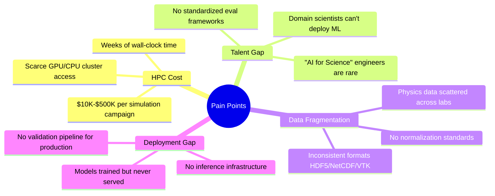
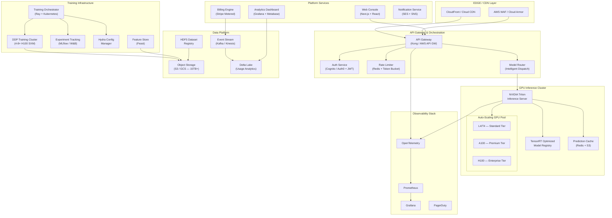
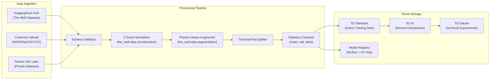
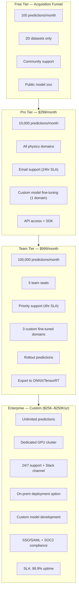
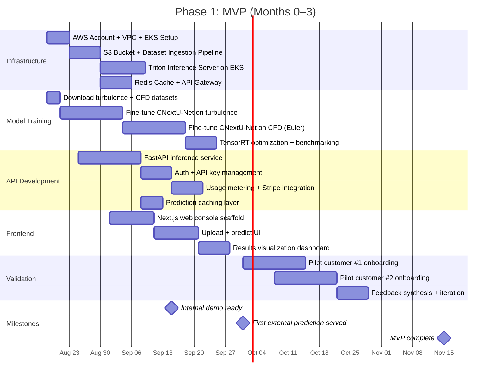
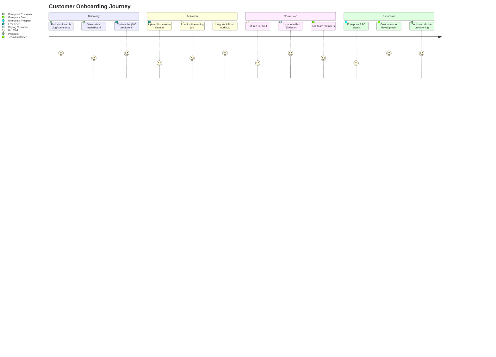
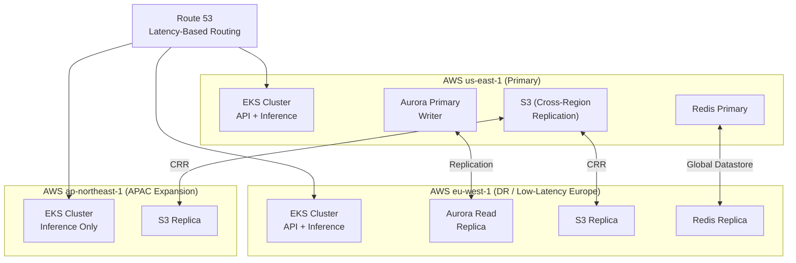
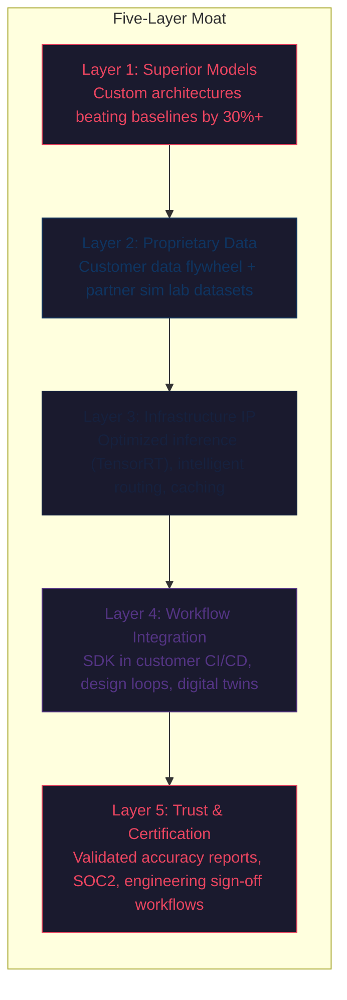

# Kontinua — Physics AI Surrogate Modeling Platform

**Executive Strategy & Production-Ready Architecture Document**
**Prepared: August 2026 | Classification: Executive Review**

---

## 1. Strategic Analysis & Concept Generation

### 1.1 Core Themes Extracted from The Well Analysis Report

The [analysis report](file:///Users/aakashpavale/Documents/AI/the_well/The_Well_Analysis_Report.md) reveals five strategic pillars:

| # | Theme | Evidence |
|---|-------|----------|
| 1 | **Massive untapped training corpus** | 15TB across 16 physics domains — BSD-licensed, NeurIPS-published, commercially permissive |
| 2 | **Production-grade ML infrastructure already exists** | PyTorch DataLoaders, Hydra configs, DDP training, WandB integration, HuggingFace streaming |
| 3 | **HPC simulation is prohibitively expensive** | Traditional CFD/MHD solvers require weeks of compute on multi-million-dollar clusters |
| 4 | **No unified multi-physics AI platform exists** | Competitors (Ansys SimAI, PhysicsX, NVIDIA PhysicsNeMo) are single-domain or hardware-locked |
| 5 | **Benchmark baselines are explicitly "not SOTA"** | The report itself calls the 8 architectures "simple baselines" — massive room for performance differentiation |

### 1.2 Pain Points Identified



### 1.3 Three Candidate Platform Concepts

---

#### Concept A: **Kontinua** — Physics AI Surrogate Modeling Platform (SaaS + API)

**Value prop:** Replace $100K+ HPC simulation campaigns with $10–$1,000 AI-powered predictions in seconds.

- Engineers upload boundary conditions → get spatiotemporal predictions 1000× faster
- Pre-trained on 15TB multi-physics corpus, fine-tunable per customer
- Usage-based API + tiered subscription model
- **TAM:** $2.9B–$6.8B CFD market + $30B simulation software market

#### Concept B: **PhysicsMLOps** — Managed Training & Evaluation Infrastructure

**Value prop:** Turnkey MLOps for scientific ML — upload data, pick architecture, launch distributed training, get validated models.

- Wraps existing Hydra/WandB/DDP pipeline into managed service
- Compute markup + enterprise SLAs
- **TAM:** $7B MLOps market, niche within scientific computing

#### Concept C: **PhysicsDataHub** — Curated Physics Dataset Marketplace (DaaS)

**Value prop:** Pre-processed, normalized, augmented physics datasets ready for training.

- Private datasets from simulation lab partnerships
- Domain-specific sub-sampling and synthetic augmentation
- **TAM:** $5B data marketplace, narrow physics vertical

---

### 1.4 Recommended Concept: Kontinua (Concept A)

> [!IMPORTANT]
> **Kontinua is the clear winner.** Here's the decision matrix:

| Criterion | Kontinua (A) | PhysicsMLOps (B) | DataHub (C) |
|-----------|:---:|:---:|:---:|
| Revenue scalability | ⬛⬛⬛⬛⬛ | ⬛⬛⬛◻◻ | ⬛⬛◻◻◻ |
| Moat depth (model IP + data) | ⬛⬛⬛⬛⬛ | ⬛⬛⬛◻◻ | ⬛⬛◻◻◻ |
| Leverages your cloud/data eng skills | ⬛⬛⬛⬛⬛ | ⬛⬛⬛⬛◻ | ⬛⬛⬛◻◻ |
| Enterprise deal size potential | ⬛⬛⬛⬛⬛ | ⬛⬛⬛◻◻ | ⬛⬛◻◻◻ |
| Time-to-first-revenue | ⬛⬛⬛⬛◻ | ⬛⬛⬛◻◻ | ⬛⬛⬛⬛◻ |
| Competitive defensibility (2026 landscape) | ⬛⬛⬛⬛◻ | ⬛⬛◻◻◻ | ⬛◻◻◻◻ |

**Why Kontinua wins:**

1. **Cloud/Data architecture is the core differentiator.** Your CTO-level expertise in AWS/Azure/GCP enterprise architecture directly maps to building the most critical competitive moat: a low-latency, multi-region inference platform with intelligent model routing — exactly what PhysicsX and Ansys SimAI are struggling to scale.

2. **Usage-based API billing creates compounding revenue.** Every prediction generates revenue. As customers integrate Kontinua into their design loops, switching costs compound — this is the Twilio/Stripe playbook applied to physics simulation.

3. **The 15TB corpus is a non-replicable head start.** While competitors would need years and millions to curate equivalent multi-physics training data, The Well's BSD license gives you immediate, legal access to train superior models.

4. **Market timing is ideal.** The 2026 landscape shows the industry transitioning from experimentation to production-grade deployment. Ansys SimAI and PhysicsX are focused on single-domain (primarily CFD). **Nobody has shipped a multi-physics surrogate API with validated engineering workflows.**

---

## 2. Platform Architecture & Tech Stack

### 2.1 High-Level System Architecture



### 2.2 Cloud Services Specification

> [!NOTE]
> **Primary cloud: AWS** (broadest GPU instance selection, Triton-native SageMaker endpoints, and your enterprise expertise). GCP as secondary for training cost optimization (Cloud TPU v5e for experimentation).

| Layer | Service | Specification | Rationale |
|-------|---------|---------------|-----------|
| **Compute — Inference** | AWS `g6.xlarge` (L4) / `g5.xlarge` (A10G) | Auto-scaling group, 2–20 instances | Cost-optimal for real-time inference ($0.50–$1.00/hr). L4 has excellent TensorRT support for neural operators |
| **Compute — Training** | AWS `p5.48xlarge` (8× H100) or GCP `a3-highgpu-8g` | On-demand + spot mix | DDP training across The Well's 15TB corpus. The existing [train.py](file:///Users/aakashpavale/Documents/AI/the_well/the_well/benchmark/train.py) already supports `dist.init_process_group(backend="nccl")` |
| **Inference Server** | NVIDIA Triton Inference Server | Dynamic batching, model ensemble, gRPC + REST | Native support for PyTorch models, TensorRT optimization, concurrent model execution |
| **Orchestration** | Amazon EKS + Karpenter | GPU-aware auto-scaling | Karpenter provisions GPU nodes in <2min vs. 10+ min for Cluster Autoscaler |
| **Object Storage** | S3 (Intelligent-Tiering) | 15TB+ datasets, model checkpoints | $0.023/GB/mo for frequent access, auto-tiering for cold data |
| **Data Pipeline** | AWS Glue + Apache Spark on EMR | HDF5 ingestion, normalization stats | Processes the `WellDataset` HDF5 format natively via h5py workers |
| **Streaming** | Amazon Kinesis Data Streams | Usage events, prediction logs | Real-time billing metering and observability |
| **Database** | Aurora PostgreSQL (Serverless v2) | User management, job metadata, billing records | Auto-scales 0→∞ ACUs, sub-10ms latency |
| **Cache** | ElastiCache Redis (Cluster Mode) | Prediction caching, rate limiting, session state | Identical-input predictions served from cache at 0 GPU cost |
| **API Gateway** | Kong (on EKS) or AWS API Gateway | Authentication, rate limiting, usage metering | Kong gives finer control over per-customer throttling and API versioning |
| **Auth** | Amazon Cognito + JWT | OAuth 2.0, SAML for enterprise SSO | Enterprise customers require SSO integration |
| **CDN** | CloudFront | Global edge, WebSocket support | Sub-50ms latency for API responses globally |
| **Monitoring** | Prometheus + Grafana + OpenTelemetry | Full-stack observability | GPU utilization, inference latency p50/p95/p99, queue depth |
| **CI/CD** | GitHub Actions + ArgoCD | GitOps deployment to EKS | Model versioning, blue-green inference deployments |
| **ML Platform** | MLflow (self-hosted on EKS) | Experiment tracking, model registry, model serving | Direct replacement for WandB in production (cost control) |

### 2.3 Data Pipeline Architecture



> [!TIP]
> The existing [WellDataset](file:///Users/aakashpavale/Documents/AI/the_well/the_well/data/datasets.py) class already handles HDF5 ingestion, trajectory sampling, and HuggingFace streaming. The [augmentation module](file:///Users/aakashpavale/Documents/AI/the_well/the_well/data/augmentation.py) provides physics-aware 2D/3D rotations and reflections. These become core pipeline components — not rebuilt, but wrapped in managed service abstractions.

### 2.4 AI Model Architecture Strategy

| Stage | Model Strategy | Source |
|-------|---------------|--------|
| **MVP (Month 1–3)** | CNextU-Net (top performer in Well benchmarks) — single-domain fine-tuning | [unet_convnext](file:///Users/aakashpavale/Documents/AI/the_well/the_well/benchmark/models/unet_convnext) |
| **V1 (Month 3–6)** | Multi-architecture ensemble — FNO + CNextU-Net + AViT with learned routing | [models/](file:///Users/aakashpavale/Documents/AI/the_well/the_well/benchmark/models) |
| **V2 (Month 6–12)** | Custom PhysicsTransformer — multi-domain foundation model pre-trained on all 16 datasets | New architecture, transfer learning across physics |
| **V3 (Month 12+)** | Physics-conditioned diffusion models for uncertainty quantification + rare event generation | Research-driven |

### 2.5 Inference Optimization Pipeline

```
PyTorch Model (.pt)
    │
    ├── torch.jit.trace() → TorchScript
    │       │
    │       └── torch-tensorrt → TensorRT Engine (.plan)
    │               │
    │               └── NVIDIA Triton Inference Server
    │                       ├── Dynamic Batching (max_batch_size=32)
    │                       ├── Model Warmup (GPU memory pre-allocation)
    │                       ├── Concurrent Model Instances (per-GPU)
    │                       └── gRPC + REST endpoints
    │
    └── ONNX Export → ONNX Runtime (CPU fallback tier)
```

**Expected latency targets:**

| Prediction Type | Resolution | Target Latency (p95) | GPU Tier |
|----------------|------------|---------------------|----------|
| 2D single-step | 128×128 | < 15ms | L4 |
| 2D single-step | 512×512 | < 50ms | A10G |
| 3D single-step | 64×64×64 | < 200ms | A100 |
| 2D rollout (100 steps) | 256×256 | < 2s | A100 |
| 3D rollout (50 steps) | 64×64×64 | < 10s | H100 |

---

## 3. Monetization & Business Model

### 3.1 Pricing Architecture



### 3.2 Usage-Based Overage Pricing

| Resource | Unit | Price |
|----------|------|-------|
| Standard prediction (2D, ≤256²) | per call | $0.01 |
| Premium prediction (3D or >256²) | per call | $0.05 |
| Rollout prediction (multi-step) | per step | $0.005 |
| Fine-tuning compute | per GPU-hour | $4.00 |
| Data storage (customer datasets) | per GB/month | $0.10 |
| Batch prediction jobs | per 1000 calls | $8.00 |

### 3.3 Revenue Projections (Conservative)

| Quarter | Users | MRR | ARR | Assumptions |
|---------|-------|-----|-----|-------------|
| Q1 (Launch) | 15 | $6K | $72K | 5 Pro + 8 Free + 2 consulting |
| Q2 | 60 | $25K | $300K | 20 Pro + 5 Team + consulting pipeline |
| Q3 | 200 | $75K | $900K | First Enterprise deal ($50K) + 40 Pro + 10 Team |
| Q4 | 500 | $180K | $2.2M | 2 Enterprise + 80 Pro + 20 Team + API overage |
| Year 2 | 2,000 | $600K | $7.2M | 8 Enterprise + scale |

### 3.4 Primary Acquisition Channels

| Channel | Strategy | CAC Target |
|---------|----------|-----------|
| **1. Developer Relations & Content** | Technical blog posts, arXiv papers, HuggingFace model cards, conference talks (NeurIPS, ICLR). Leverage the NeurIPS 2024 publication as credibility anchor. | $50–$200 |
| **2. Open Benchmarking Leaderboard** | Free public leaderboard ("MLPerf for Physics AI") using the [evaluation suite](file:///Users/aakashpavale/Documents/AI/the_well/the_well/benchmark/metrics). Drives organic traffic + positions Kontinua as the standard. | $0–$50 |
| **3. Strategic Consulting (Land)** | $20K–$100K consulting engagements with aerospace/energy companies. Deliver custom surrogate models, then upsell to platform subscription. | Negative CAC (revenue-generating) |
| **4. Academic Partnerships** | Free/discounted access for university labs. PhD students become tomorrow's enterprise buyers. Partner with Polymathic AI's network (Flatiron, NYU, Cambridge). | $0–$100 |
| **5. Vertical-Specific Sales** | Direct outreach to CFD teams at Boeing, Lockheed, Shell, GE. Position as "reduce your Ansys Fluent bill by 80%." | $5K–$20K (enterprise) |
| **6. Cloud Marketplace Listing** | AWS Marketplace + GCP Marketplace listings. Enables procurement through existing cloud contracts (critical for enterprise). | $0 (marketplace handles) |

---

## 4. Production-Ready Execution Plan

### Phase 1: Proof of Concept & MVP (Months 0–3)

**Objective:** Train best-performing model on 2 verticals, build inference API, validate with 2–3 pilot customers.

#### 4.1.1 Core Features

| Feature | Description | Priority |
|---------|-------------|----------|
| **Single-domain inference API** | REST + gRPC endpoints for turbulence and CFD predictions | P0 |
| **Model fine-tuning pipeline** | Upload HDF5 → automatic normalization → DDP training → checkpoint | P0 |
| **Web upload interface** | Drag-and-drop boundary conditions → get predictions | P0 |
| **Evaluation dashboard** | Spatial + spectral + temporal metrics visualization | P1 |
| **API key management** | Self-serve API key generation, usage metering | P1 |
| **Prediction caching** | Redis-backed cache for identical inputs | P1 |

#### 4.1.2 Initial Data Models

```python
# Core domain models (SQLAlchemy / Prisma)

class Organization:
    id: UUID
    name: str
    plan: Enum[FREE, PRO, TEAM, ENTERPRISE]
    api_key_hash: str
    monthly_prediction_quota: int
    predictions_used_this_month: int

class PredictionJob:
    id: UUID
    org_id: FK → Organization
    model_id: FK → Model
    physics_domain: Enum[TURBULENCE, CFD, MHD, ...]
    input_config: JSON  # boundary conditions, initial state
    input_hash: str     # for cache dedup
    status: Enum[QUEUED, RUNNING, COMPLETED, FAILED]
    result_s3_uri: str
    latency_ms: int
    gpu_type: str
    cost_cents: int
    created_at: datetime

class Model:
    id: UUID
    name: str
    architecture: Enum[CNEXTUNET, FNO, TFNO, AVIT, ...]
    physics_domain: str
    version: str
    checkpoint_s3_uri: str
    triton_model_name: str
    input_schema: JSON
    output_schema: JSON
    benchmark_metrics: JSON  # VRMSE, spectral MSE, etc.
    is_public: bool

class FineTuningJob:
    id: UUID
    org_id: FK → Organization
    base_model_id: FK → Model
    dataset_s3_uri: str
    status: Enum[QUEUED, TRAINING, EVALUATING, COMPLETED, FAILED]
    hydra_config: JSON
    wandb_run_id: str
    gpu_hours_consumed: float
    resulting_model_id: FK → Model  # nullable until complete
    created_at: datetime

class UsageEvent:
    id: UUID
    org_id: FK → Organization
    event_type: Enum[PREDICTION, FINE_TUNING, STORAGE, BATCH]
    quantity: int
    unit_price_cents: int
    total_cents: int
    stripe_invoice_item_id: str
    created_at: datetime
```

#### 4.1.3 Time-to-Market Strategy



#### 4.1.4 MVP Technology Decisions

| Decision | Choice | Rationale |
|----------|--------|-----------|
| **Inference framework** | NVIDIA Triton on EKS | Native PyTorch → TensorRT path, dynamic batching, gRPC. Avoids SageMaker lock-in. |
| **API framework** | FastAPI (Python) | Same language as the Well codebase. Async, OpenAPI auto-docs, Pydantic validation. |
| **Frontend** | Next.js 14 (App Router) | SSR for SEO, React Server Components for dashboard perf, Vercel-deployable. |
| **Database** | Aurora PostgreSQL Serverless v2 | Zero-to-production, auto-scaling, no capacity planning. |
| **Billing** | Stripe Billing (Metered) | Usage-based billing out of the box, customer portal, invoicing. |
| **Auth** | Clerk or Auth0 | Faster than Cognito for MVP, enterprise SSO later. |
| **IaC** | Terraform + Helm | Reproducible multi-region deployments from Day 1. |

#### 4.1.5 MVP Infrastructure Cost Estimate

| Component | Monthly Cost | Notes |
|-----------|-------------|-------|
| EKS cluster (control plane + 3 nodes) | $400 | m6i.xlarge worker nodes |
| GPU inference (2× g6.xlarge spot) | $600 | L4 GPUs, spot instances |
| Training (on-demand H100, ~50 hrs) | $250 | Phase 1 only |
| Aurora PostgreSQL Serverless | $50 | Minimal ACU usage |
| S3 (500GB datasets + checkpoints) | $15 | Standard tier |
| ElastiCache Redis | $70 | cache.t4g.medium |
| CloudFront + Route53 | $30 | Nominal traffic |
| Monitoring (Prometheus/Grafana) | $0 | Self-hosted on EKS |
| **Total** | **~$1,415/mo** | |

---

### Phase 2: Beta Launch & Initial Monetization (Months 3–6)

**Objective:** Self-serve platform launch, 50+ users, first $25K MRR.

#### 4.2.1 Feature Expansion

| Feature | Description |
|---------|-------------|
| **Self-serve fine-tuning** | Customers upload datasets → automated training pipeline → model deployed to their namespace |
| **Multi-architecture selection** | Choose from FNO, TFNO, CNextU-Net, AViT per prediction job |
| **Batch prediction API** | Submit 1,000+ prediction requests, async processing, webhook notification |
| **Public benchmarking leaderboard** | Community submits models, evaluated against Well metrics suite |
| **SDK (Python)** | `pip install kontinua` — 5-line prediction from any Python environment |
| **Rollout predictions** | Multi-step temporal evolution (not just single-step) |
| **Team management** | Multi-seat orgs, RBAC, shared model registry |

#### 4.2.2 Onboarding Flow



#### 4.2.3 Infrastructure Scaling Strategy

| Trigger | Auto-Scale Action | Implementation |
|---------|------------------|----------------|
| Inference queue depth > 10 | Add GPU node (Karpenter) | `NodePool` with `nvidia.com/gpu: 1` resource request |
| GPU utilization > 80% for 5min | Scale up inference replicas | HPA with custom Prometheus metric |
| Training job submitted | Provision on-demand H100 spot | Karpenter `NodePool` with `p5.48xlarge` instance type |
| Training job complete | Terminate training node in 5min | Karpenter TTL + node consolidation |
| Prediction cache hit rate < 70% | Increase Redis cluster shards | ElastiCache auto-scaling |
| API latency p99 > 500ms | Add API server replicas | HPA on CPU/memory |

#### 4.2.4 Feedback Loops

| Loop | Mechanism | Action |
|------|-----------|--------|
| **Model quality** | Customer rates prediction accuracy (1–5 stars) | Feed into active learning — retrain on misses |
| **Feature requests** | In-app feedback widget + Intercom | Weekly triage → sprint planning |
| **Usage analytics** | Kinesis → Delta Lake → Metabase dashboards | Identify most-used physics domains for investment |
| **Churn signals** | Declining API calls, login frequency drop | Automated customer success outreach |
| **Benchmark tracking** | Community leaderboard submissions | Incorporate winning architectures into platform |

---

### Phase 3: Scale & Enterprise Ready (Months 6–12)

**Objective:** Enterprise-grade platform, $180K+ MRR, first $50K+ enterprise contracts, foundation model.

#### 4.3.1 Advanced AI Features

| Feature | Technical Approach |
|---------|-------------------|
| **Multi-physics foundation model** | Pre-train PhysicsTransformer across all 16 Well datasets using multi-task learning. Serves as base for zero-shot cross-domain transfer. |
| **Uncertainty quantification** | Ensemble predictions + Monte Carlo dropout → confidence intervals on every prediction. Critical for engineering certification workflows. |
| **Physics-constrained inference** | Embed PDE residuals as loss terms during fine-tuning. Guarantees conservation laws (mass, energy, momentum) in outputs. |
| **Agentic simulation copilot** | LLM agent (Gemini/Claude) that recommends: optimal model architecture per physics domain, simulation parameters, and interprets results in natural language. |
| **Rare event generation** | Train conditional diffusion models on extreme-value subsets. Generate synthetic data for events too expensive to simulate (nuclear safety, aerospace failure modes). |
| **Real-time digital twin integration** | WebSocket streaming API for continuous prediction updates. SDK for Siemens MindSphere, AWS IoT TwinMaker integration. |

#### 4.3.2 High-Availability Architecture



**SLA Targets:**

| Metric | Target | Implementation |
|--------|--------|----------------|
| Uptime | 99.95% | Multi-AZ EKS, Aurora Multi-AZ, Redis cluster |
| Inference latency (p99) | < 500ms (2D), < 5s (3D rollout) | Triton warm models, prediction caching, Karpenter pre-provisioning |
| Training job start time | < 5 minutes | Karpenter GPU provisioners, pre-built container images |
| Data durability | 99.999999999% (11 nines) | S3 cross-region replication |
| RTO (Recovery Time Objective) | < 15 minutes | Aurora failover, EKS pod rescheduling, Route53 health checks |
| RPO (Recovery Point Objective) | < 1 minute | Aurora continuous backup, S3 versioning |

#### 4.3.3 Security & Compliance

| Requirement | Implementation |
|-------------|----------------|
| SOC 2 Type II | AWS Config rules, CloudTrail, automated evidence collection |
| Data encryption at rest | S3 SSE-KMS, Aurora TDE, EBS encryption |
| Data encryption in transit | TLS 1.3 everywhere, mTLS for service mesh (Istio) |
| Network isolation | VPC with private subnets, NACLs, security groups, no public IPs for GPU nodes |
| Customer data isolation | Per-org S3 prefix + IAM policies, namespace-level Kubernetes RBAC |
| Audit logging | CloudTrail + CloudWatch Logs → S3 (immutable), 365-day retention |
| Vulnerability management | ECR image scanning, Snyk in CI/CD, weekly pen-test reviews |
| GDPR compliance | Data residency in eu-west-1, right-to-deletion API, DPA templates |

#### 4.3.4 Team & Operational Requirements

| Role | When to Hire | Responsibility |
|------|-------------|---------------|
| **Founding Engineer #1 — ML/Infra** | Month 0 (you or co-founder) | Model training, Triton deployment, inference optimization |
| **Founding Engineer #2 — Platform** | Month 1 | API development, billing integration, web console |
| **ML Engineer — Neural Operators** | Month 3 | Architecture R&D, foundation model training, benchmark optimization |
| **DevOps / SRE** | Month 4 | EKS operations, CI/CD, monitoring, on-call rotation |
| **Product Manager** | Month 5 | Feature prioritization, customer interviews, roadmap |
| **Sales Engineer** | Month 6 | Enterprise demos, POC support, technical sales |
| **Customer Success** | Month 6 | Onboarding, churn reduction, usage optimization |
| **Domain Expert (Physics/CFD)** | Month 6 (contractor → FTE) | Validation, customer credibility, model quality assurance |
| **Frontend Engineer** | Month 8 | Web console, visualization, dashboards |
| **Security Engineer** | Month 9 | SOC 2 prep, pen testing, compliance |

**Headcount trajectory:** 2 (Month 0) → 4 (Month 3) → 8 (Month 6) → 12 (Month 12)

---

## 5. Competitive Moat Strategy

> [!IMPORTANT]
> The underlying data and 8 baseline models are open-source. **The moat must be built on 5 layers:**



---

## 6. Risk Mitigation

| Risk | Probability | Impact | Mitigation |
|------|:-----------:|:------:|------------|
| NVIDIA ships a competing managed service via PhysicsNeMo | High | High | Differentiate on multi-physics breadth, vertical specialization, and UX. Position as cloud-agnostic vs. NVIDIA-locked. |
| Ansys SimAI captures enterprise market first | Medium | High | Win mid-market first ($299–$999/mo tiers). Ansys pricing ($100K+ seats) leaves massive underserved market. |
| Model accuracy insufficient for production engineering | Medium | Critical | Invest in physics-constrained training, uncertainty quantification, and co-development with domain experts. Never claim to replace verification — augment it. |
| Open-source competitors build on same Well data | Medium | Medium | Speed advantage (6+ months head start) + proprietary model improvements + customer data flywheel creates compounding moat. |
| GPU costs erode margins at scale | Low | Medium | TensorRT optimization reduces inference cost 3–5×. Prediction caching eliminates redundant GPU usage. Spot instances for training. |
| Customer data privacy concerns | Medium | High | SOC 2, per-org data isolation, on-prem deployment option for Enterprise tier. Customer data never used in shared model training without explicit consent. |

---

## User Review Required

> [!IMPORTANT]
> **Key decisions requiring your input before proceeding to execution:**
>
> 1. **Primary vertical selection:** The report recommends starting with either **aerospace CFD** or **energy turbulence**. Which vertical aligns better with your existing network and potential pilot customers?
>
> 2. **Cloud provider preference:** The plan defaults to **AWS** given broadest GPU selection and your enterprise experience. Do you have existing AWS organizational accounts, or would you prefer to start on GCP/Azure?
>
> 3. **Solo founder vs. co-founder:** Phase 1 assumes you are the founding ML/Infra engineer. Are you planning to recruit a technical co-founder for the platform engineering role, or will you staff this with a senior hire?
>
> 4. **Funding strategy:** The plan is bootstrappable through Phase 1 (~$1.4K/mo infra + consulting revenue). At what point would you consider raising external capital, and does that affect Phase 2 timeline?
>
> 5. **Brand and naming:** "Kontinua" is the working name from the analysis report. Do you want to proceed with this, or explore alternatives before any public-facing work begins?

## Open Questions

> [!WARNING]
> **Technical dependencies to resolve:**
>
> - The [neuraloperator==0.3.0](file:///Users/aakashpavale/Documents/AI/the_well/pyproject.toml#L70) dependency is pinned and CUDA-only. Need to verify TensorRT compatibility for FNO/TFNO model export.
> - The existing [train.py](file:///Users/aakashpavale/Documents/AI/the_well/the_well/benchmark/train.py) has `dist.init_process_group(backend="nccl")` hardcoded. The production training pipeline will need a configurable backend abstraction.
> - Customer data format standardization: The Well uses HDF5 exclusively. Enterprise customers may submit VTK, OpenFOAM, or NetCDF formats. A format conversion layer must be scoped.
