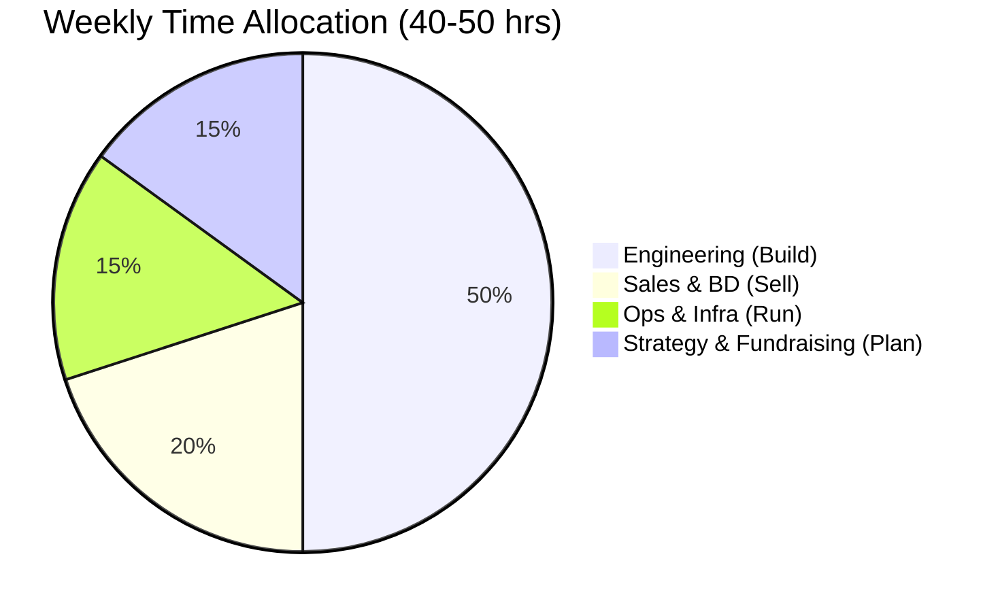
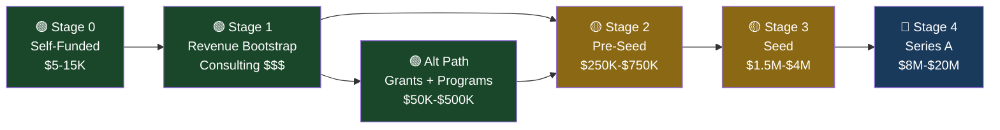
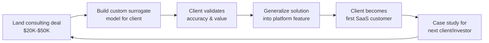
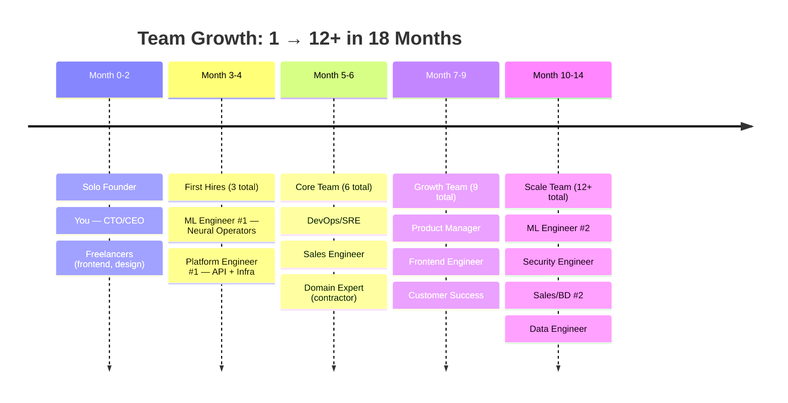
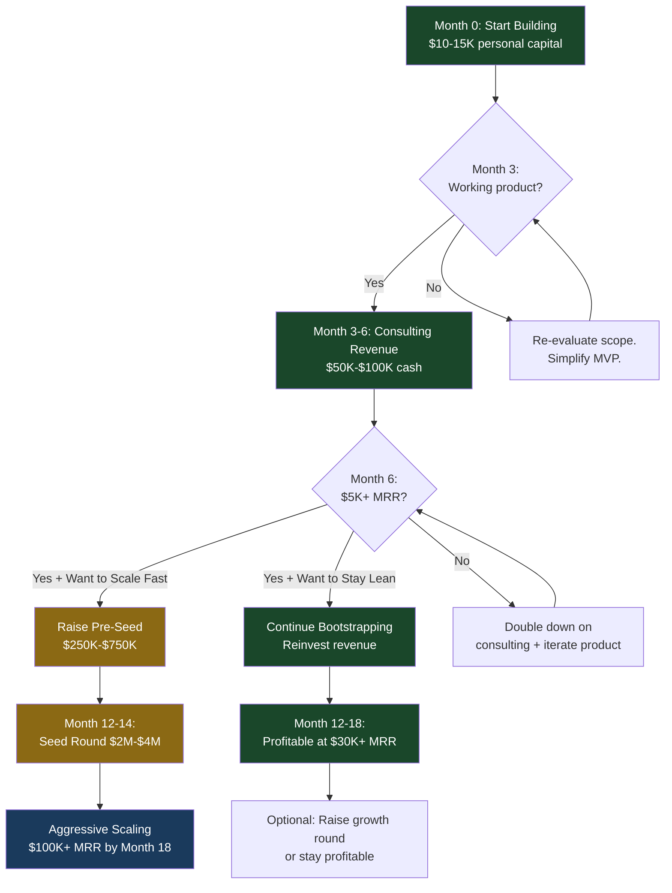

# Kontinua — Solo Founder Execution & Funding Playbook

**The practical guide to going from 1 person to a funded team**

---

## 1. Solo Execution Strategy (Months 0–6)

### 1.1 The Reality Check

You are operating as **four roles simultaneously**. Here's how to structure your week to avoid burnout and maintain velocity:



### 1.2 Weekly Operating Rhythm

| Day | Morning (4 hrs) | Afternoon (4 hrs) | Evening (1-2 hrs) |
|-----|-----------------|-------------------|-------------------|
| **Mon** | 🔧 Engineering — model training, API dev | 🔧 Engineering — continued | 📋 Week planning, metrics review |
| **Tue** | 🔧 Engineering — inference pipeline | 💼 Sales — outreach, LinkedIn, emails | 📖 Industry reading, competitor tracking |
| **Wed** | 🔧 Engineering — frontend/dashboard | 🤝 Customer calls, demos, consulting | ✍️ Content — blog post or technical write-up |
| **Thu** | 🔧 Engineering — testing, deployment | 💼 Sales — follow-ups, proposals | 📋 Investor research, deck updates |
| **Fri** | 🛠️ DevOps — monitoring, cost review | 🤝 Networking — community, events | 🧘 Personal buffer / overflow |
| **Sat** | 🔧 Engineering sprint (optional 4 hrs) | — | — |

### 1.3 What To Do Yourself vs. Outsource vs. Automate

| Task | Decision | Rationale |
|------|----------|-----------|
| **Model training & ML pipeline** | ✅ Do yourself | Your core IP. Nobody else should touch this early. |
| **Inference API (FastAPI + Triton)** | ✅ Do yourself | Core product. Your cloud architecture expertise shines here. |
| **Infrastructure (Terraform, EKS)** | ✅ Do yourself | Your strength. Will take you 2x less time than a hire. |
| **Frontend web console** | 🟡 Outsource | Hire a freelance React/Next.js dev ($3K–$8K for MVP). You set the design spec, they build it. |
| **Logo, brand identity, landing page** | 🟡 Outsource | Fiverr/99designs for logo ($200–$500). Framer/Webflow for landing page. |
| **Legal (incorporation, terms, IP)** | 🟡 Outsource | Use Stripe Atlas ($500) for US Delaware C-Corp or consult a startup lawyer ($1K–$3K). |
| **Accounting & bookkeeping** | 🟡 Outsource | Pilot.com or a local CA ($200–$500/mo) once revenue starts. |
| **Content marketing & blog** | ✅ Do yourself | You're the domain expert. AI can draft, you polish. Technical credibility is non-outsourceable. |
| **Sales outreach emails** | 🤖 Automate | Apollo.io or Instantly.ai for sequenced outreach ($100/mo). |
| **Social media presence** | 🤖 Automate | Buffer/Typefully for scheduling. Repurpose blog posts into LinkedIn/X threads. |
| **Usage metering & billing** | 🤖 Automate | Stripe Billing handles this end-to-end. Don't build custom. |
| **CI/CD & deployments** | 🤖 Automate | GitHub Actions + ArgoCD. Set up once, never touch again. |
| **Monitoring & alerts** | 🤖 Automate | Prometheus + PagerDuty. Automated runbooks for common failures. |

### 1.4 What NOT To Build (Critical Scope Control)

> [!CAUTION]
> As a solo founder, over-building is the #1 killer. These are things you **skip entirely** until you have revenue or funding:

| Don't Build | Do Instead |
|-------------|------------|
| Custom auth system | Use Clerk ($0–$25/mo) or Auth0 free tier |
| Custom billing engine | Stripe Billing + metered subscriptions |
| Custom monitoring stack | Grafana Cloud free tier (10K metrics) |
| Multi-region HA | Single region (us-east-1) is fine until you have 100+ customers |
| Mobile app | Responsive web only |
| Admin dashboard from scratch | Use Retool ($0 free tier) for internal ops |
| Custom email system | SendGrid/Resend free tier |
| Foundation model training | Start with fine-tuned CNextU-Net. Foundation model is a Phase 3 problem. |

---

## 2. Funding Ladder — Stage by Stage

### 2.1 Overview: The 7-Stage Funding Ladder



---

### Stage 0: Self-Funded (Now — Month 2)

**Trigger:** You're starting. No revenue yet.

| Item | Cost | Notes |
|------|------|-------|
| AWS infrastructure (MVP) | $1,400/mo | As per Phase 1 architecture plan |
| Domain + email + basic SaaS tools | $100/mo | Namecheap, Google Workspace, GitHub |
| Freelance frontend dev (1 month) | $5,000 | One-time, MVP web console |
| Legal (incorporation) | $500–$2,000 | Stripe Atlas (US) or local incorporation |
| GPU training runs (initial) | $500 | Cloud H100 spot instances for model fine-tuning |
| **Total needed** | **$10K–$15K** | **3 months of runway at bare minimum** |

> [!TIP]
> **How to fund Stage 0:**
> - Personal savings ($10K–$15K is a reasonable bet with your CTO-level income history)
> - Continue part-time consulting/contracting while building (see Stage 1)
> - Credit: AWS Activate program gives **$10K–$100K in free credits** for startups. Apply immediately.

**Immediate actions:**
1. Apply to **AWS Activate** (Founders tier: $1K credits, Portfolio tier: $100K credits via an accelerator)
2. Apply to **GCP for Startups** ($2K–$200K credits)
3. Apply to **NVIDIA Inception** (free GPU credits, technical mentorship, co-marketing)
4. Apply to **HuggingFace Expert Acceleration Program** (free Inference Endpoints credits)

---

### Stage 1: Revenue-Funded Bootstrap via Consulting (Months 1–4)

**Trigger:** You have a working model that produces results.

This is your **secret weapon** — your CTO/COO background means you can close $20K–$100K consulting deals while building the product. Consulting is not a distraction; it's your funded R&D lab.

**The Consulting → Product Flywheel:**



**Where to find consulting clients:**

| Channel | Approach | Expected Deal Size |
|---------|----------|-------------------|
| **Your existing network** | Reach out to former colleagues, clients, vendors in aerospace/energy | $20K–$100K |
| **LinkedIn outbound** | Target VP Engineering / Head of Simulation at F500 manufacturers | $30K–$80K |
| **Toptal / a]team** | Register as an expert in AI + simulation. Projects find you. | $15K–$50K |
| **Upwork (enterprise)** | "AI/ML for computational physics" — niche = high rates | $10K–$30K |
| **Conference networking** | NeurIPS, ICLR, SC (Supercomputing), AIAA — attend or present | Relationship building |
| **Polymathic AI network** | Contact the Well authors (Flatiron, NYU). They likely know orgs needing this. | Warm intros |

**Revenue target from consulting:**

| Month | Deals | Revenue | Cumulative |
|-------|-------|---------|------------|
| Month 1–2 | 1 small engagement | $15K | $15K |
| Month 3 | 1 medium engagement | $30K | $45K |
| Month 4 | 1 medium + 1 retainer starting | $40K | $85K |
| Month 5–6 | Retainer + new deal | $50K | $135K |

> [!IMPORTANT]
> **$85K–$135K in consulting revenue over 6 months** is realistic with your background. This funds all of Phase 1 and most of Phase 2 without giving up any equity.

---

### Stage 1.5: Non-Dilutive Funding — Grants & Programs (Apply in Months 1–3)

These run in parallel with consulting. Many take 3–6 months to process, so apply early.

| Program | Amount | Fit | Timeline |
|---------|--------|-----|----------|
| **NVIDIA Inception** | GPU credits + co-marketing | Perfect — physics AI on NVIDIA GPUs | 2–4 weeks to join |
| **AWS Activate (Portfolio)** | $100K AWS credits | Apply through an accelerator partner | 2–4 weeks |
| **GCP for Startups** | $2K–$200K credits | Apply directly or via accelerator | 2–4 weeks |
| **Microsoft for Startups (Founders Hub)** | $1K–$150K Azure credits | Direct application | 1–2 weeks |
| **NSF SBIR/STTR Phase I** (if US entity) | $275K | "AI for Scientific Simulation" fits perfectly | 6–9 month review cycle |
| **DOE SBIR** (if US entity) | $200K–$1.1M | Directly targets computational science | 6–9 month review cycle |
| **Innovate UK Smart Grant** (if UK entity) | £25K–£500K | AI + engineering simulation | 3–6 months |
| **DST NIDHI** (India, PRAYAS) | ₹10L (~$12K) | Early-stage tech startups | 2–3 months |
| **iDEX (India, Defence)** | Up to ₹1.5Cr (~$180K) | If targeting defence simulation use cases | 3–6 months |
| **MEITY Startup Hub (India)** | ₹25L–₹1Cr ($30K–$120K) | AI/ML deep-tech startups | 3–6 months |
| **Y Combinator** | $500K ($125K safe + $375K MFN) | 7% dilution. Massive network. S25/W26 batch. | Batch cycle (biannual) |
| **Techstars** | $120K | 6% equity. Industry-specific tracks. | Batch cycle |

> [!TIP]
> **High-ROI move:** Apply to **NVIDIA Inception** (Week 1), **AWS Activate** (Week 1), and **YC** (next batch deadline). These three alone could net you $100K+ in credits and $500K in funding.

---

### Stage 2: Pre-Seed Round ($250K–$750K) — Months 4–6

**Trigger conditions (need at least 3 of 5):**
- ✅ Working product with live API serving predictions
- ✅ 2+ paying customers or signed LOIs (Letters of Intent)
- ✅ $5K+ MRR or $50K+ in consulting revenue
- ✅ Demonstrable model accuracy beating published baselines
- ✅ Clear vertical traction (e.g., aerospace, energy)

**Who to raise from:**

| Investor Type | Examples | Typical Check | What They Want |
|---------------|----------|---------------|----------------|
| **Angel investors (Deep Tech)** | Individuals from your CTO network, ex-founders in enterprise SaaS | $25K–$100K | Founder conviction + domain expertise |
| **Deep-tech pre-seed funds** | Radical Ventures, Boost VC, Conviction, Moxxie Ventures | $100K–$500K | Technical moat + large TAM |
| **India-focused (if relevant)** | Speciale Invest, pi Ventures, Kalaari Capital (early) | $100K–$500K | Deep-tech thesis fit |
| **Climate/Science-focused** | Lowercarbon Capital, Congruent Ventures, Prelude Ventures | $100K–$300K | If positioning around sustainability/energy |
| **Strategic angels** | Engineers/executives at Ansys, Siemens, Boeing, Shell | $25K–$50K | Industry validation + customer intros |

**What you need for pre-seed:**

| Asset | Status |
|-------|--------|
| Pitch deck (12–15 slides) | Build in Month 3. Cover: problem, demo, market, traction, team, ask. |
| Live product demo | Working API + web console with real predictions |
| 2–3 customer testimonials or LOIs | From consulting engagements |
| Financial model (18-month projection) | Spreadsheet showing path to $1M ARR |
| Technical differentiation doc | Benchmark results showing your models beat published baselines |

**Use of funds ($500K pre-seed):**

| Allocation | Amount | Hires/Purpose |
|------------|--------|---------------|
| Engineering salaries (2 hires) | $250K | ML Engineer + Platform Engineer (12 months) |
| Cloud infrastructure | $100K | GPU training + inference scaling |
| Go-to-market | $50K | Conference travel, content, sales tools |
| Legal + compliance | $30K | SOC 2 prep, contracts, IP protection |
| Buffer | $70K | 3 months runway extension |

**Expected dilution:** 10–15% (SAFE notes or priced round at $3M–$5M valuation)

---

### Stage 3: Seed Round ($1.5M–$4M) — Months 9–14

**Trigger conditions:**
- $20K+ MRR with month-over-month growth
- 30+ active customers across 2+ verticals
- Team of 4–6 people
- Foundation model training underway
- First enterprise contract signed ($50K+)

**Target investors:**

| Fund | Thesis Fit | Typical Check |
|------|-----------|---------------|
| **a16z (Infra)** | AI infrastructure, developer tools | $1M–$5M |
| **Radical Ventures** | AI-first scientific computing | $1M–$3M |
| **Lightspeed** | Enterprise SaaS, AI platforms | $2M–$5M |
| **General Catalyst** | Deep tech, platform plays | $2M–$5M |
| **Khosla Ventures** | Scientific AI, climate tech | $1M–$4M |
| **NVIDIA Ventures** | Strategic — GPU ecosystem expansion | $500K–$2M |
| **Accel (India/Global)** | Enterprise SaaS, deep tech | $1M–$4M |

**Use of funds ($2.5M seed):**

| Allocation | Amount |
|------------|--------|
| Team expansion (8 → 12 headcount) | $1.2M |
| GPU infrastructure (foundation model training) | $500K |
| Sales & marketing | $300K |
| Product development | $200K |
| Legal, compliance, SOC 2 | $100K |
| Buffer (6 months runway) | $200K |

---

### Stage 4: Series A ($8M–$20M) — Month 18–24

**Trigger conditions:**
- $100K+ MRR ($1.2M+ ARR)
- 3+ enterprise contracts ($50K–$250K/yr each)
- Net revenue retention > 120%
- Foundation model with demonstrable multi-physics transfer
- Clear path to $5M ARR in 12 months

At this stage, VCs will find you. Focus on execution, not fundraising.

---

## 3. Team Scaling Roadmap

### 3.1 Hiring Sequence (The Right Person at the Right Time)



### 3.2 Detailed Hiring Plan

---

#### Hire #1: ML Engineer — Neural Operators (Month 3)

**Why now:** You've validated the product with consulting clients. Now you need someone to push model quality while you focus on platform + sales.

| Attribute | Detail |
|-----------|--------|
| **Profile** | PhD or strong MS in computational physics, applied math, or ML. Published work in neural operators (FNO, DeepONet) or PDE-constrained optimization. |
| **Key skills** | PyTorch, distributed training (DDP/FSDP), Fourier methods, physics-informed ML |
| **Where to find** | NeurIPS/ICML poster sessions, Polymathic AI's contributor network, X/Twitter ML research community, university lab cold emails |
| **Compensation** | $80K–$130K salary + 2–4% equity (4-year vest, 1-year cliff) |
| **First 90 days** | Beat CNextU-Net baseline by 20%+ on turbulence dataset. Own the training pipeline. |

> [!TIP]
> **Hiring hack:** Post a "ML Research Challenge" on your benchmarking leaderboard. Top performers get invited to interview. This is how Kaggle Grand Masters get hired — adapt the model for physics AI.

---

#### Hire #2: Platform Engineer (Month 3–4)

**Why now:** The API, billing, and web console need dedicated engineering. You can't keep doing infra + ML + platform.

| Attribute | Detail |
|-----------|--------|
| **Profile** | 4+ years backend engineering. Strong in Python (FastAPI/Django), PostgreSQL, Redis, Kubernetes. API design expertise. |
| **Key skills** | REST/gRPC API design, Stripe integration, EKS/Kubernetes, Terraform, CI/CD |
| **Where to find** | Hacker News "Who's Hiring", LinkedIn, your professional network, AngelList |
| **Compensation** | $90K–$140K salary + 1.5–3% equity |
| **First 90 days** | Ship self-serve sign-up, API key management, usage metering, and Stripe billing integration. |

---

#### Hire #3: DevOps / SRE (Month 5)

**Why now:** You have paying customers. Downtime = revenue loss. You need someone owning reliability while you and the team ship features.

| Attribute | Detail |
|-----------|--------|
| **Profile** | 3+ years SRE/DevOps. Kubernetes-native. GPU infrastructure experience is a massive plus. |
| **Key skills** | EKS, Karpenter, Prometheus/Grafana, Terraform, on-call rotation |
| **Where to find** | SRE-specific communities, KubeCon network, DevOps meetups |
| **Compensation** | $85K–$130K salary + 1–2% equity |
| **Contractor alternative** | Use a fractional DevOps firm (e.g., Gruntwork, Spacelift) for $5K–$10K/mo until you can afford FTE |

---

#### Hire #4: Sales Engineer (Month 6)

**Why now:** You have a product worth selling and a pipeline from consulting. You need someone to run demos and close while you focus on product.

| Attribute | Detail |
|-----------|--------|
| **Profile** | Technical sales background in simulation software, CAE, or enterprise SaaS. Can demo to engineers and present to VPs. |
| **Key skills** | Technical demos, POC management, Salesforce/HubSpot, enterprise sales cycles |
| **Where to find** | Ansys/Siemens/COMSOL alumni, LinkedIn Sales Navigator, B2B SaaS sales communities |
| **Compensation** | $70K–$100K base + commission (OTE $120K–$180K) + 0.5–1.5% equity |

---

#### Hire #5: Domain Expert — Physics/CFD (Month 6, Start as Contractor)

**Why now:** Enterprise customers will not trust a platform that can't speak their language. A domain expert validates your models and builds credibility in customer conversations.

| Attribute | Detail |
|-----------|--------|
| **Profile** | PhD in fluid dynamics, CFD, or aerospace engineering. 5+ years in industry or national lab. Ideally has used Ansys/COMSOL/OpenFOAM. |
| **Key skills** | CFD validation, turbulence modeling, mesh generation, engineering standards |
| **Where to find** | National labs (Sandia, LANL, Argonne), Boeing/Lockheed/GE alumni, university adjuncts |
| **Compensation** | Start as contractor ($150–$250/hr, 10–20 hrs/month). Convert to FTE ($130K–$170K + equity) if traction warrants. |

---

### 3.3 Compensation Framework

| Stage | Cash : Equity Mix | Rationale |
|-------|:---:|-----------|
| **Hires #1–2** (Pre-seed) | 60% cash : 40% equity-weighted | Below-market cash, compensated with meaningful equity (2–4%). These are your co-building partners. |
| **Hires #3–5** (Post pre-seed) | 75% cash : 25% equity-weighted | Closer to market cash. Equity is still significant (1–2%) but less than founding team. |
| **Hires #6–12** (Post seed) | 90% cash : 10% equity-weighted | Market-rate cash. Equity is standard startup grants (0.25–1%). |

### 3.4 Equity Allocation Framework

```
Founder (You): 100% at incorporation
    │
    ├── ESOP Pool: Reserve 20% at pre-seed
    │   ├── Hire #1 (ML Eng):      3.0%
    │   ├── Hire #2 (Platform):    2.5%
    │   ├── Hire #3 (DevOps):      1.5%
    │   ├── Hire #4 (Sales):       1.0%
    │   ├── Hire #5 (Domain):      1.0%
    │   ├── Hires #6-12:           5.0% (distributed)
    │   └── Future hires reserve:  6.0%
    │
    ├── Pre-seed investors:        10-15%
    │
    ├── Seed investors:            15-20%
    │
    └── Founder remaining:         ~50-55% post-seed
```

> [!IMPORTANT]
> **Your vesting:** Even as solo founder, adopt a 4-year vesting schedule with 1-year cliff on your own shares. Investors will require this, and it signals maturity. If you set this up at incorporation, it's on your terms.

---

## 4. Financial Runway Model

### 4.1 Monthly Burn Rate Projection

| Month | Infrastructure | People | Tools & Services | Consulting Revenue | Net Burn |
|:---:|---:|---:|---:|---:|---:|
| 1 | $1,400 | $0 | $300 | $0 | -$1,700 |
| 2 | $1,400 | $0 | $300 | $0 | -$1,700 |
| 3 | $1,400 | $0 | $5,300 | +$15,000 | +$8,300 |
| 4 | $2,000 | $15,000 | $500 | +$15,000 | -$2,500 |
| 5 | $2,500 | $15,000 | $500 | +$20,000 | +$2,000 |
| 6 | $3,000 | $25,000 | $800 | +$25,000 | -$3,800 |
| 7 | $4,000 | $35,000 | $1,000 | +$10,000 | -$30,000 |
| 8 | $5,000 | $40,000 | $1,000 | +$5,000 | -$41,000 |

> [!NOTE]
> Month 7–8 is where **pre-seed funding kicks in**. Without it, you'd need to maintain higher consulting revenue. The pre-seed ($250K–$500K) gives you 8–12 months of runway at the Month 7–8 burn rate.

### 4.2 Two Paths: Bootstrapped vs. Funded



---

## 5. Key Metrics Investors Want (by Stage)

| Metric | Pre-Seed Target | Seed Target | Series A Target |
|--------|:-:|:-:|:-:|
| **MRR** | $5K+ | $30K+ | $100K+ |
| **Paying customers** | 5+ | 30+ | 100+ |
| **MoM revenue growth** | 20%+ | 15%+ | 10%+ |
| **Net revenue retention** | N/A | 110%+ | 120%+ |
| **CAC payback period** | N/A | < 12 months | < 8 months |
| **Gross margin** | 50%+ | 65%+ | 75%+ |
| **Team size** | 1–3 | 5–8 | 10–15 |
| **Enterprise contracts** | LOI/pilot | 1–2 signed | 3–5 signed |

---

## 6. Week 1 Action Items

Here's exactly what to do starting Monday:

| # | Action | Time | Tool/Resource |
|---|--------|------|--------------|
| 1 | **Incorporate** the company (US Delaware C-Corp or India Pvt Ltd) | 2 hours | Stripe Atlas / local CA |
| 2 | **Apply to AWS Activate** for startup credits | 30 min | [aws.amazon.com/activate](https://aws.amazon.com/activate) |
| 3 | **Apply to GCP for Startups** | 30 min | [cloud.google.com/startup](https://cloud.google.com/startup) |
| 4 | **Apply to NVIDIA Inception** | 30 min | [nvidia.com/inception](https://www.nvidia.com/en-us/startups/) |
| 5 | **Set up AWS account** + VPC + first EKS cluster (Terraform) | 4 hours | Your expertise |
| 6 | **Download smallest dataset** (turbulent_radiative_layer_2D, 6.9GB) | 1 hour | `the-well-download` CLI |
| 7 | **Start fine-tuning CNextU-Net** on cloud H100 | 10 hours (automated) | Lambda Labs / RunPod |
| 8 | **Write 3 LinkedIn posts** about physics AI + surrogate modeling | 1 hour | Build public presence from Day 1 |
| 9 | **Email 5 people in your network** who work in aerospace/energy/manufacturing | 1 hour | Warm outreach for consulting leads |
| 10 | **Set up landing page** | 2 hours | Framer or simple Next.js on Vercel |

> [!TIP]
> **The single most important thing you do in Week 1 is action #9.** Technology without customers is a hobby. Your network is your unfair advantage — use it immediately.
