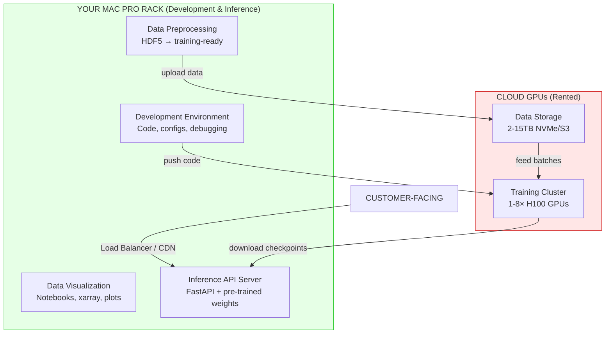

# The Well — Deep Repository Analysis & Monetization Opportunities

## What This Repo Is
The Well is a 15TB large-scale collection of machine learning datasets containing numerical simulations of spatiotemporal physical systems, published at NeurIPS 2024 by Polymathic AI (Flatiron Institute, NYU, Cambridge, etc.).

| Aspect | Detail |
| --- | --- |
| **Scale** | 15TB across 16+ datasets, up to 10,000 trajectories per dataset |
| **Domains** | Fluid dynamics, astrophysics (supernovae, neutron stars), biology (active matter), acoustics, viscoelasticity, MHD |
| **License** | BSD 3-Clause — commercially permissive ✅ |
| **Published** | PyPI package, HuggingFace hosting, NeurIPS 2024 paper |
| **Tech Stack** | PyTorch, HDF5, Hydra configs, WandB logging, distributed training (DDP) |

## Core Assets in the Repo

### 1. Data Infrastructure
* **WellDataset**: PyTorch Dataset class with HDF5 reader, HuggingFace streaming, trajectory-level sampling
* **WellDataModule**: Full data pipeline with train/val/test splits, distributed sampler support
* **Augmentation**: Physics-aware augmentations (2D/3D rotations, reflections preserving symmetries)
* **Normalization**: Z-Score normalization with delta statistics
* **Export**: HDF5 → xarray conversion (numpy + dask backends)

### 2. Benchmark Models (8 Architectures)
| Model | Type |
| --- | --- |
| FNO | Fourier Neural Operator |
| TFNO | Tucker-Factorized FNO |
| UNetClassic | Classic U-Net |
| UNetConvNext | Modernized U-Net with ConvNext |
| AFNO | Adaptive FNO |
| AViT | Attention Vision Transformer |
| DilatedResNet | Dilated Residual Network |
| ReFNO | Reparametrized FNO |

### 3. Evaluation Suite
* **Spatial metrics**: MAE, MSE, RMSE, NRMSE, NMSE, NMAE, LInfinity, PearsonR, VMSE, VRMSE
* **Spectral metrics**: Binned spectral MSE (Fourier domain)
* **Temporal metrics**: Histogram Wasserstein-1 distance, Windowed DTW
* **Visualization**: Power spectrum plots, field histograms, rollout videos

### 4. 16+ Physics Simulation Datasets
Covering: acoustic scattering, active biological matter, convective stellar envelopes, Euler equations, Gray-Scott reaction-diffusion, Helmholtz, magneto-hydrodynamics (MHD), shallow water on planets, neutron star mergers, Rayleigh-Bénard convection, Rayleigh-Taylor instability, shear flows, supernova explosions, turbulence, radiative layers, viscoelastic instabilities.

---

## Monetization Opportunities

### 🟢 Tier 1 — High Feasibility / Near-Term Revenue

#### 1. Physics AI Surrogate Modeling Platform (SaaS)
**"SimForge" — Replace expensive HPC simulations with AI predictions**
* **What**: Build a cloud platform where engineers upload boundary conditions/initial states and get predictions 1000× faster than traditional solvers
* **Revenue model**: Usage-based pricing ($0.01–$1.00 per prediction), tiered subscriptions
* **Target customers**: Aerospace (CFD), energy (turbulence), defense, automotive
* **Moat**: Pre-trained models on 15TB of diverse physics + your fine-tuning pipeline
* **Market size**: Computational fluid dynamics market alone is $2.5B+ by 2030

#### 2. MLOps-for-Science Platform
**Managed training + evaluation infrastructure for physics ML**
* **What**: Wrap the existing Hydra/WandB/DDP training pipeline into a managed service where researchers can upload data, select architectures, and launch distributed training
* **Revenue model**: Compute markup (GPU-hours), premium model architectures, enterprise SLAs
* **Target customers**: National labs, pharma (molecular dynamics), climate research teams
* **Key advantage**: The benchmark infrastructure is already production-quality

#### 3. Curated Physics Dataset Marketplace
**"The Well Premium" — Domain-specific, preprocessed, ready-to-train datasets**
* **What**: While The Well data is open, package it with:
  * Pre-computed statistics & normalization parameters
  * Custom sub-sampling for specific use cases
  * Augmented/synthetic data generation
  * Private datasets from partnerships with simulation labs
* **Revenue model**: Dataset licensing ($5K–$50K per domain), subscription for continuous updates
* **Target customers**: ML teams at engineering firms, academic labs without HPC

### 🟡 Tier 2 — Medium Feasibility / Mid-Term Revenue

#### 4. Foundation Model for Physics (Pre-trained Weights API)
**"PhysicsGPT" — One model, many physics domains**
* **What**: Train a large foundation model across all 16 datasets (multi-task), then offer fine-tuning-as-a-service or an inference API
* **Revenue model**: API calls ($0.001–$0.10 per inference), fine-tuning fees ($500–$5000 per domain adaptation)
* **Competitive angle**: No one else has a unified 15TB multi-physics pre-training corpus with benchmark infrastructure
* **Technical path**: The repo's multi-dataset DataModule and model architecture zoo are the starting point

#### 5. Simulation-Augmented Digital Twins
**Real-time physics prediction layer for industrial digital twins**
* **What**: Integrate surrogate models into digital twin platforms (e.g., for manufacturing plants, oil rigs, power grids)
* **Revenue model**: Enterprise licensing ($50K–$500K/yr), integration services
* **Target customers**: Siemens, GE, Schneider Electric, or their customers
* **Advantage**: The benchmark models already handle 2D and 3D spatiotemporal data with proper boundary conditions

#### 6. Educational Platform / Online Course
**"Physics ML Academy" — Teaching scientific ML with real data**
* **What**: Build courses around:
  * Neural operators (FNO/TFNO) for PDE solving
  * Scientific data handling (HDF5, xarray, normalization)
  * Benchmark methodology for physics-informed ML
* **Revenue model**: Course fees ($200–$2000), university licensing, bootcamp partnerships
* **Market**: Growing demand for "AI for Science" talent

#### 7. Consulting & Custom Model Development
**Build custom surrogate models for specific client physics problems**
* **What**: Use The Well's infrastructure as a starting framework, bring your own simulation data from clients
* **Revenue model**: Project-based ($20K–$200K), retainers for ongoing model updates
* **Target customers**: Defense contractors, energy companies, biotech (fluid/cell simulations)

### 🔵 Tier 3 — Longer-Term / Visionary Plays

#### 8. Physics Simulation Copilot (AI Agent)
**AI assistant for computational scientists**
* **What**: An agent that can:
  * Recommend appropriate simulation parameters
  * Predict convergence and suggest solver configurations
  * Auto-select the right surrogate model architecture for a given physics domain
  * Generate visualization reports
* **Revenue model**: IDE plugin subscription, API access
* **Technical path**: The Hydra config system + model registry is already agent-friendly

#### 9. Synthetic Data Generation for Rare Events
**Generate training data for extreme physics scenarios**
* **What**: Use trained surrogate models to generate synthetic simulations of rare events (extreme turbulence, material failure, etc.) that are too expensive to simulate traditionally
* **Revenue model**: Per-generation pricing, defense/safety contracts
* **Target customers**: Nuclear safety, aerospace certification, insurance risk modeling

#### 10. Benchmarking-as-a-Service for ML Research
**The "MLPerf for Scientific AI"**
* **What**: Standardized leaderboard + evaluation service where ML researchers submit models and get comprehensive physics-aware evaluations (VRMSE, spectral fidelity, rollout stability)
* **Revenue model**: Freemium leaderboard, premium detailed reports ($50–$500 per evaluation), sponsored challenges
* **Competitive position**: Already the NeurIPS benchmark standard

#### 11. Real-Time Weather / Climate Prediction API
**Leverage planetswe (shallow water equations on sphere) and turbulence datasets**
* **What**: Fine-tune surrogate models for atmospheric/oceanic prediction, offer a lightweight weather API
* **Revenue model**: API subscription, enterprise weather intelligence
* **Market**: Weather intelligence market is $4B+

#### 12. Astrophysics Simulation API
**On-demand supernova / neutron star merger / MHD simulations**
* **What**: Serve pre-trained surrogate models for astrophysical phenomena
* **Revenue model**: Research grants, observatory partnerships, educational licensing
* **Target customers**: Space agencies (NASA, ESA), university astrophysics departments

---

## Strategic Advantages You Already Have

| Advantage | Detail |
| --- | --- |
| **BSD License** | Full commercial freedom — no copyleft restrictions |
| **NeurIPS pedigree** | Published at a top ML venue; instant credibility |
| **HuggingFace presence**| Data + model checkpoints already on HF hub |
| **Production-ready code**| PyPI package, Hydra configs, DDP training, WandB integration |
| **Comprehensive metrics**| Spatial, spectral, and temporal evaluation suite |
| **Multi-domain** | 16 physics domains in one framework — rare |

---

## Recommended First Moves

> [!IMPORTANT]
> The fastest path to revenue is Option 1 (Surrogate Modeling SaaS) combined with Option 7 (Consulting), targeting a specific vertical like aerospace CFD or energy turbulence.

### Phase 1 (0–3 months): Foundation
* Pick one vertical (e.g., turbulence modeling for energy or CFD for aerospace)
* Fine-tune the best-performing model (CNextU-net dominates most benchmarks) on the relevant dataset
* Build a simple inference API (FastAPI + GPU serving)
* Validate with 2–3 pilot customers (consulting engagements)

### Phase 2 (3–6 months): Product
* Wrap the API into a self-serve platform with upload/predict UX
* Add model fine-tuning capability for customer-specific physics
* Launch the benchmarking leaderboard to build community

### Phase 3 (6–12 months): Scale
* Train the multi-physics foundation model
* Expand to adjacent verticals
* Raise funding using NeurIPS publication + customer traction

---

## Risk Factors

> [!WARNING]
> * The underlying data and code are open-source — competitors can use the same starting point
> * The benchmark models are explicitly described as "simple baselines, not state-of-the-art"
> * 15TB of data requires significant GPU infrastructure to train on
> * Domain expertise in each physics area is needed for credible customer engagement
> 
> The moat must be built through: superior model performance (better architectures), domain-specific fine-tuning, customer relationships, and speed of execution.

---

# Infrastructure Requirements for The Well — Honest Assessment

## TL;DR

| Question | Answer |
| :--- | :--- |
| **Will a Mac Pro Rack work for training?** | ❌ No — hard CUDA/NCCL dependency, no MPS support in codebase |
| **Will a Mac Pro Rack work for inference?** | ⚠️ Partially — with significant code porting effort |
| **Best starting option?** | ☁️ Cloud GPUs (Lambda Labs / RunPod / GCP) — $2–4/hr per H100 |
| **Can you do this on a budget?** | ✅ Yes — start with smaller datasets (~7–50GB) on a single GPU |

## Why Mac Pro Rack Won't Work for Training
The codebase has deep, hard dependencies on NVIDIA CUDA that cannot be worked around:

### 1. NCCL Backend for Distributed Training
The training script at `train.py` uses:
```python
dist.init_process_group(backend="nccl", ...)  # NVIDIA-only
```
NCCL (NVIDIA Collective Communications Library) has zero Apple Silicon support.

### 2. CUDA-Specific Operations
The `train.py` is hardcoded to CUDA:
```python
torch.cuda.set_device(local_rank)
device = torch.device("cuda")
```
There is no MPS (Apple Metal) fallback anywhere in the codebase — I searched and confirmed zero hits for `mps`, `apple`, or `metal`.

### 3. FFT Operations Are CUDA-Optimized
The FNO/TFNO/AFNO/ReFNO models all rely on `torch.fft.rfftn` / `torch.fft.irfftn` — while these technically work on CPU, they are 10–50× slower than cuFFT on NVIDIA GPUs, and the entire neural operator paradigm is built around fast Fourier transforms.

### 4. neuraloperator Library
The FNO model depends on `neuraloperator==0.3.0`, which is built and tested exclusively for CUDA.

### 5. Benchmark Reference = NVIDIA H100
The SLURM config shows: 1 GPU node, 32 CPU cores, 10-hour time-boxed training. The paper explicitly states benchmarks were done on NVIDIA H100 GPUs.

> [!CAUTION]
> Verdict: A Mac Pro Rack (even M2 Ultra with 192GB unified memory) cannot run this training pipeline. You would need to rewrite the entire training stack, port all FFT operations to MPS, and replace NCCL — a multi-month effort with no guaranteed performance parity.

## What a Mac Pro Rack CAN Do

| Task | Feasibility | Notes |
| :--- | :--- | :--- |
| Data exploration & visualization | ✅ Great | HDF5 reading, xarray, matplotlib all work perfectly |
| Dataset preprocessing & statistics | ✅ Great | CPU-bound, 192GB RAM is excellent for large datasets |
| Model inference (after porting) | ⚠️ Possible | Would need to port models to MPS, ~1-2 weeks work |
| API server hosting | ✅ Great | Serve pre-trained models via FastAPI |
| Development & testing | ✅ Great | Code editing, CI, small-batch testing on CPU |

## Recommended Infrastructure by Phase

### Phase 1: Experimentation & Prototyping (Month 1–2)
Goal: Train models on 1–2 small datasets, validate approach

| Component | Recommendation | Cost |
| :--- | :--- | :--- |
| **GPU Compute** | Single NVIDIA H100 (80GB) — cloud rental | $2–4/hr |
| **Storage** | 500GB NVMe attached to GPU instance | Included |
| **Datasets to start** | `turbulent_radiative_layer_2D` (6.9GB) or `active_matter` (51GB) | Free (open data) |
| **Training time** | ~10 hrs per model per dataset (from benchmark config) | ~$20–40 per run |
| **Total budget** | Train 4 models × 2 datasets = ~8 runs | ~$160–320 |

Best cloud GPU providers (price/performance ranked):

| Provider | H100 80GB Price | Notes |
| :--- | :--- | :--- |
| Lambda Labs | ~$2.49/hr | Best value, easy setup |
| RunPod | ~$2.49/hr | On-demand + spot available |
| Vast.ai | ~$2.00/hr | Cheapest, peer-to-peer (less reliable) |
| GCP (A100 80GB) | ~$3.67/hr | Enterprise SLAs, more reliable |
| AWS (p5.xlarge H100) | ~$5.12/hr | Most reliable, most expensive |

### Phase 2: MVP Product (Month 3–4)
Goal: Fine-tune best models, build inference API, serve first customers

| Component | Recommendation | Cost/month |
| :--- | :--- | :--- |
| **Training GPU** | 1× H100 cloud instance, ~100 hrs/month | ~$250–400/mo |
| **Inference GPU** | 1× NVIDIA L4 or T4 (cheaper, inference-optimized) | ~$0.50–1.00/hr |
| **API Server** | Any cloud VM (4 vCPU, 16GB RAM) or your Mac Pro Rack ✅ | ~$50–100/mo |
| **Storage** | 2TB cloud storage (for datasets + checkpoints) | ~$40/mo |
| **Model registry** | HuggingFace Hub (free) or W&B | Free–$50/mo |
| **Total** | | ~$400–600/mo |

### Phase 3: Production Scale (Month 5+)
Goal: Multi-dataset training, foundation model, auto-scaling inference

| Component | Recommendation | Cost/month |
| :--- | :--- | :--- |
| **Training cluster** | 4–8× H100 (multi-GPU DDP training) | ~$5K–15K/mo |
| **Inference cluster** | 2–4× L4/T4 behind load balancer | ~$1K–3K/mo |
| **Data storage** | 15TB+ (full Well dataset) | ~$300–500/mo |
| **Orchestration** | Kubernetes + Ray/Kubeflow | Engineering time |
| **Monitoring** | W&B, Prometheus, Grafana | ~$100–300/mo |
| **Total** | | ~$7K–20K/mo |

## Architecture Diagram



## Concrete "Start Tomorrow" Setup
If you want to begin immediately with minimal cost:

### Step 1: Use your Mac for data exploration
```bash
# Install The Well on your Mac
pip install the_well
# Download the smallest dataset (6.9GB)
the-well-download --base-path ./data --dataset turbulent_radiative_layer_2D --split train
```

### Step 2: Rent a single cloud GPU for training
```bash
# On Lambda Labs / RunPod — spin up 1× H100 instance
# SSH in, clone the repo, install deps
git clone https://github.com/PolymathicAI/the_well
cd the_well
pip install ".[benchmark]" --extra-index-url https://download.pytorch.org/whl/cu121

# Train the best-performing model (CNextU-Net) on small dataset
cd the_well/benchmark
python train.py experiment=unet_convnext server=local data=turbulent_radiative_layer_2D
```

### Step 3: Download trained weights back to Mac
```bash
# Copy model checkpoint to your Mac
scp gpu-instance:~/the_well/experiments/*/checkpoints/best.pt ./models/

# Serve inference API from your Mac Pro Rack
# (after minor code modifications to load on CPU/MPS)
```

## Alternative: On-Prem NVIDIA Options
If you want to own hardware instead of renting cloud:

| Hardware | GPU Memory | Price | Good For |
| :--- | :--- | :--- | :--- |
| NVIDIA RTX 4090 | 24GB VRAM | ~$1,600 | Small 2D datasets, prototyping |
| NVIDIA RTX 6000 Ada | 48GB VRAM | ~$6,500 | Medium datasets, most 2D training |
| NVIDIA A100 80GB (used) | 80GB VRAM | ~$10,000 | Full benchmark reproduction |
| NVIDIA H100 SXM | 80GB HBM3 | ~$30,000 | Production training, 3D datasets |
| NVIDIA DGX Station | 4× A100 | ~$150,000 | Foundation model training |

> [!TIP]
> Best bang-for-buck on-prem: A workstation with 2× RTX 4090 (24GB each) for ~$5K total can handle all 2D datasets and most 3D datasets with gradient checkpointing enabled. The repo already supports this via the `gradient_checkpointing: True` flag in FNO config.

## Storage Requirements by Dataset

| Dataset | Size | Can fit on Mac Pro? | Training VRAM needed |
| :--- | :--- | :--- | :--- |
| turbulent_radiative_layer_2D | 6.9 GB | ✅ | ~8 GB |
| active_matter | 51.3 GB | ✅ | ~12 GB |
| helmholtz_staircase | 52 GB | ✅ | ~16 GB |
| viscoelastic_instability_v2 | 66 GB | ✅ | ~16 GB |
| MHD_64 | 72 GB | ✅ | ~24 GB |
| shear_flow | 115 GB | ✅ | ~12 GB |
| gray_scott_reaction_diffusion | 154 GB | ✅ | ~8 GB |
| rayleigh_benard | 358 GB | ✅ | ~16 GB |
| convective_envelope_rsg | 570 GB | ✅ | ~40 GB |
| supernova_explosion_128 | 754 GB | ⚠️ | ~48 GB |
| euler (all) | 5,170 GB | ❌ | ~40 GB |
| MHD_256 | 4,580 GB | ❌ | ~80 GB |
| **Full Well** | **~15 TB** | **❌** | **Multi-GPU** |

## My Recommendation

> [!IMPORTANT]
> Hybrid approach — Mac Pro Rack + Cloud GPU
> 
> * Keep your Mac Pro Rack as your development server, data preprocessor, and inference API host
> * Rent cloud H100s only when you need to train (~$2.50/hr, pay only for what you use)
> * Start with the 3 smallest datasets (6.9GB, 51GB, 52GB) — total cost for initial training: under $500
> * Don't buy NVIDIA hardware until you have paying customers validating the product
> 
> This gives you the fastest path to market with minimal upfront investment.
